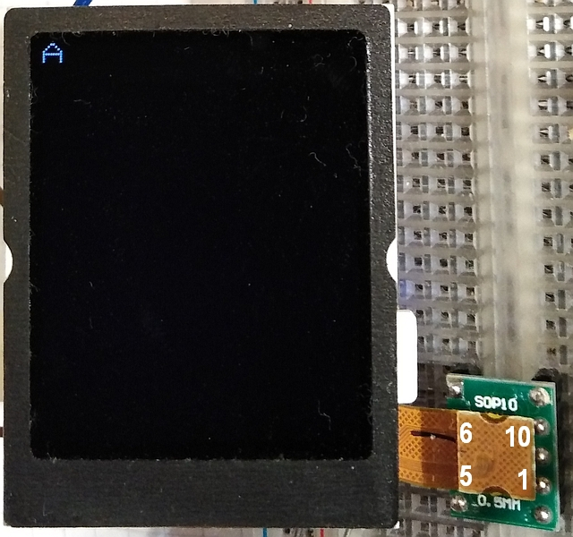

# Gigaset OpenStage SL4 Display
## Arduino test sketch for Gigaset OpenStage SL4 Display
### Labeled as: WD-F1216YU-6FLWa
### Controller similar to ST7735
### works with https://github.com/olikraus/ucglib
#### Pinout:
```
1  = +4,7V BG LED (21mA)

2  = LED GND

3  = D/CX

4  = SCX

5  = RESX

6  = SDA

7  = VDDI (+1,8V)

8  = SCL

9  = GND

10 = VDD (+2,8V)
```



